---
nav:
  title: 组件
  order: 0
group:
  title: 组件总览
  order: -1
---

# 概要

### 通用

  

    <a href="./components/button">
Button 按钮

    </a>
  

  

    <a href="./components/icon">
Icon 图标

    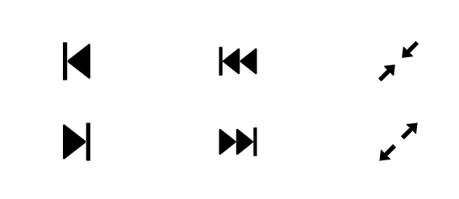</a>
  

### 布局

  

    <a href="./components/divider">
Divider 分割线

    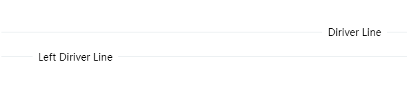</a>
  

  

    <a href="./components/space">
Space 间距

    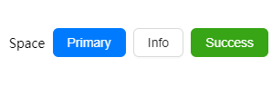</a>
  

### 导航

  

     <a href="./components/breadcrumb">
Breadcrumb 面包屑

    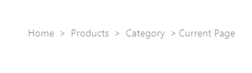</a>
  

  

     <a href="./components/step">
Steps 步骤条

    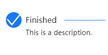</a>
  

### 数据录入

### 数据展示

  

    <a href="./components/badge">
Badge 标签

    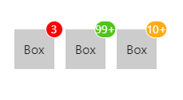</a>
  

  

    <a href="./components/card">
Card 卡片

    </a>
  

  

    <a href="./components/ribbon">
Ribbon 标签

    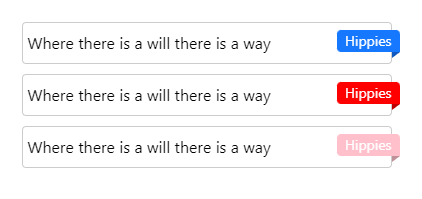</a>
  

  

    <a href="./components/tag">
Tag 标签

    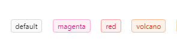</a>
  

  

    <a href="./components/collapse">
Collapse 折叠面板

    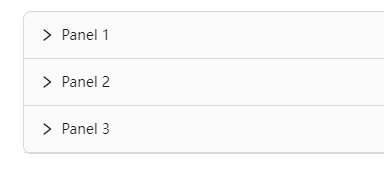</a>
  

### 反馈

  

    <a href="./components/spin">
Spin 加载中

    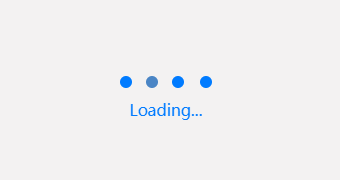</a>
  

  

    <a href="./components/watermark">
Watermark 水印

    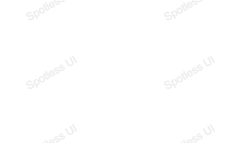</a>
  

